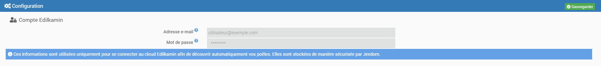

# Plugin Jeedilkamin

# Description

Plugin permettant de contrôler les poëles Edilkamin via la librairie python [Edilkamin.py](https://github.com/AndreMiras/edilkamin.py).

# Configuration du plugin

Une fois le plugin installé, il faut renseigner vos informations de connexion Edilkamin :

-   **Adresse email** : Renseignez l'adresse email de l'application Edilkamin.
-   **Mot de passe** : Renseignez le mot de passe de l'application Edilkamin.

# Configuration des équipements

Vous retrouvez ici toute la configuration de votre équipement :

-   **Nom de l’équipement** : nom de votre équipement Netatmo.
-   **Objet parent** : indique l’objet parent auquel appartient l’équipement.
-   **Catégorie** : Catégorie de l'équipement (Chauffage, Sécurité, Energie...).
-   **Activer** : permet de rendre votre équipement actif.
-   **Visible** : le rend visible sur le dashboard.
-   **Adresse Mac** : Adresse mac de l'appareil.

En dessous vous retrouvez la liste des commandes :

-   le nom affiché sur le dashboard
-   historiser : permet d’historiser la donnée
-   configuration avancée (petites roues crantées) : permet d’afficher la configuration avancée de la commande (méthode d’historisation, widget…)
-   Tester : permet de tester la commande

> **ASTUCE**
>
> Le nombre de ventilateur est récupéré automatiquement à la première sauvegarde de votre équipement.

# FAQ

>**Quelle est la fréquence de rafraichissement ?**
>
>Le systeme recupère les informations toutes les 5 minutes.