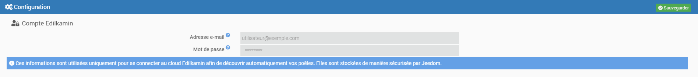
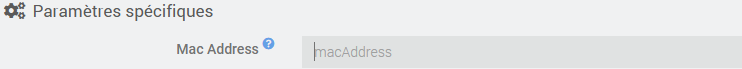

# Plugin Jeedilkamin

## Description

Plugin permettant de contrôler les poêles à pellets Edilkamin via l'API cloud "The Mind". Il s'appuie sur la librairie Python [edilkamin](https://pypi.org/project/edilkamin/) pour communiquer avec vos appareils.

## Prérequis

- Un compte sur l'application **The Mind** (Edilkamin)
- Le poêle connecté au WiFi et visible dans l'application
- L'adresse MAC WiFi du poêle (visible dans l'app : Paramètres → Logiciel → MAC MQTT)

> Testé sur **Edilkamin Blade Up** (firmware 2.1.211117a, 2 ventilateurs canalisés).

## Configuration du plugin

Une fois le plugin installé, renseignez vos informations de connexion dans la page de configuration :

- **Adresse e-mail** : l'email de votre compte The Mind
- **Mot de passe** : le mot de passe de votre compte The Mind

Ces informations sont utilisées uniquement pour s'authentifier auprès du cloud Edilkamin.

## Configuration des équipements

Depuis la page du plugin, cliquez sur **Ajouter** pour créer un nouvel équipement.

- **Nom de l'équipement** : nom affiché dans Jeedom
- **Objet parent** : objet auquel appartient l'équipement
- **Catégorie** : catégorie de l'équipement
- **Activer / Visible** : activation et visibilité sur le dashboard
- **Adresse Mac** : adresse MAC WiFi du poêle (format `aabbccddeeff`)
- **Auto-actualisation** : fréquence du cron de rafraîchissement (ex: `*/5 * * * *` pour toutes les 5 minutes)

À la première sauvegarde, le plugin se connecte au poêle et crée automatiquement toutes les commandes en fonction de la configuration de votre appareil (nombre de ventilateurs, niveaux de puissance, etc.).

## Commandes créées automatiquement

### Informations

| Commande | Description |
|---|---|
| Etat | Poêle allumé (1) ou éteint (0) |
| Phase | Phase de fonctionnement en cours |
| Puissance | Niveau de puissance actuel (P1→P5) |
| Alarme | Code de la dernière alarme |
| Température ambiante | Température mesurée par le poêle |
| Consigne | Température cible |
| Température fumées | Température des fumées (thermocouple) |
| Température carte | Température de la carte électronique |
| Pression air | Pression des fumées en Pascal |
| Mode AUTO | Mode automatique actif |
| Mode Relax | Mode relax actif |
| Autonomie pellets | Temps restant avant épuisement des pellets |
| Puissance manuelle | Niveau de puissance manuelle configuré |
| Réserve pellets | Capteur de niveau bas déclenché |
| Entretien requis | Entretien nécessaire |
| Nettoyage en cours | Cycle de nettoyage actif |
| Chrono actif | Mode chrono actif |
| Standby actif | Mode veille actif |
| Airkare actif | Mode Airkare actif |
| Signal WiFi | Qualité du signal WiFi |
| Nb allumages | Nombre total d'allumages |
| Dernier rafraîchissement | Date et heure du dernier rafraîchissement |
| Fan X | Vitesse actuelle du ventilateur X |

### Actions

| Commande | Description |
|---|---|
| Power ON / OFF | Allumer / éteindre le poêle |
| Auto ON / OFF | Activer / désactiver le mode automatique |
| Relax ON / OFF | Activer / désactiver le mode relax |
| Température consigne | Régler la consigne (16-22°C) |
| Vitesse fan X | Régler la vitesse du ventilateur X |
| Puissance utilisateur | Régler le niveau de puissance (P1→P5) |

## Rafraîchissement des données

Le plugin adapte automatiquement la fréquence de rafraîchissement selon l'état du poêle :

| État | Fréquence |
|---|---|
| Éteint | 5 minutes |
| Allumé (fonctionnement stable) | 2 minutes |
| Allumage / extinction / alarme | 30 secondes |

Le cron configuré dans l'équipement sert de filet de sécurité supplémentaire.

## Modals disponibles

Depuis la page d'un équipement, deux boutons donnent accès à des informations détaillées :

- **Alarmes** (bouton orange) : historique complet des alarmes groupées par année, avec codes traduits
- **Compteurs** (bouton bleu) : heures de fonctionnement par niveau de puissance, total et depuis le dernier entretien, avec indicateur de progression vers les 2000h recommandées

## FAQ

> **Les commandes ne sont pas créées après la sauvegarde**
>
> Vérifiez que le démon est bien démarré et que l'adresse MAC est correcte. Les commandes sont créées lors du premier retour du démon après la sauvegarde.

> **Quelle adresse MAC renseigner ?**
>
> L'adresse MAC WiFi du poêle, visible dans l'application The Mind : Paramètres → Logiciel → MAC MQTT. Elle est différente de l'adresse Bluetooth.

> **Le poêle ne répond plus**
>
> Vérifiez le signal WiFi dans les commandes info. Si le token JWT est expiré, le démon le renouvelle automatiquement.
